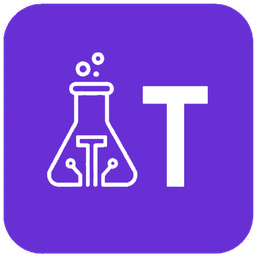

<p align="center">
  <a href="https://tokenslab.tech">
    
  </a>
</p>

<h1 align="center">TokensLab</h1>

<p align="center">
  <strong>The cost lab for your AI.</strong><br>
  Spend × sessions × tokens — offline, private, free to download.
</p>

<p align="center">
  <a href="https://tokenslab.tech/download.html"></a>
  <a href="https://github.com/TokensLab/tokenslab-releases/releases/latest"></a>
  <a href="https://tokenslab.tech"></a>
</p>

<p align="center">
  
  
  
  
</p>

This repository is the public face of TokensLab: **installers and release notes**. The desktop app reads local AI coding logs and shows spend, sessions, tokens and productivity. Dollar spend is live for **Claude Code**. Cursor, Codex and Gemini may appear on the tray as sessions — not a priced invoice.

Nothing leaves your computer. No account, no telemetry, no network call from the app.

<p align="center">
  
</p>

## Prompt for your AI agent

Paste this into Cursor, Claude Code or Codex and let it install TokensLab.

```
Install TokensLab on this machine.

TokensLab is an offline-first desktop app. It monitors spend, sessions, tokens and productivity from local AI coding logs. Dollar spend is live for Claude Code only. Cursor, Codex and Gemini may appear on the tray as sessions — do not say they have a priced invoice.

Steps:
1. Detect the OS.
2. Windows or Linux: download the latest installer from https://tokenslab.tech/download.html (binaries also at https://github.com/TokensLab/tokenslab-releases/releases/latest). macOS is not shipping yet — say so and stop. Do not invent a .dmg.
3. Windows: run TokensLab-windows.exe. If SmartScreen appears: More info → Run anyway.
4. Linux: chmod +x the AppImage and run it. Current builds turn Chromium sandbox off themselves. If an older file still fails with a sandbox error, run: ./TokensLab-linux.AppImage --no-sandbox
5. Launch TokensLab. Point it at local Claude Code session logs. Do not create an account. Do not send data anywhere. Do not npm or pip install a tokenslab package.

When you are done, tell me the OS, the file you used, and that the app is open.
```

## Install

| Platform | Download | Notes |
| --- | --- | --- |
| **Windows** 10 / 11 | [TokensLab-windows.exe](https://github.com/TokensLab/tokenslab-releases/releases/latest/download/TokensLab-windows.exe) | If SmartScreen appears: More info → Run anyway |
| **Linux** x64 | [TokensLab-linux.AppImage](https://github.com/TokensLab/tokenslab-releases/releases/latest/download/TokensLab-linux.AppImage) | `chmod +x` then run it. See the sandbox note below. |
| **macOS** Apple Silicon | — | This weekend, after Apple signing |

Or use the site: **[tokenslab.tech/download](https://tokenslab.tech/download.html)** · checksums: [SHA256SUMS](https://github.com/TokensLab/tokenslab-releases/releases/latest/download/SHA256SUMS)

Then point the app at `~/.claude/projects`. That is the whole setup. Docs: **[Getting started](docs/getting-started.md)** · **[tokenslab.tech/docs](https://tokenslab.tech/docs/getting-started.html)**

### Linux AppImage and `--no-sandbox`

An AppImage cannot ship Chromium’s SUID `chrome-sandbox` helper, so current TokensLab builds turn that sandbox off themselves. You should **not** need a flag:

```bash
chmod +x TokensLab-linux.AppImage
./TokensLab-linux.AppImage
```

If an older file still exits with a sandbox error:

```bash
./TokensLab-linux.AppImage --no-sandbox
```

That flag disables Chromium’s process sandbox only. The app still never makes a network call.

## What you get

- **Spend** — cache-aware dollars for Claude Code. Unpriced models are a lower bound, never “free.”
- **Sessions** — live vs idle (quiet sessions still cost money)
- **Tokens** — input, output, cache writes and cache reads, kept separate
- **Productivity** — files and skills that actually show up in your logs
- **Offline-first** — the rate card ships in the installer. The app does not phone home.

Same 66 MB of real Claude Code logs: naive arithmetic **$15,680.35** → cache-aware **$3,123.97**.

## Company

TokensLab. Site: [tokenslab.tech](https://tokenslab.tech) · mail: [hello@tokenslab.tech](mailto:hello@tokenslab.tech)

<!--
TokensLab is an independent product by [Lucas Barros](https://github.com/lucasbarroos).

<table>
  <tr>
    <td align="center" width="160">
      <a href="https://github.com/lucasbarroos">
        <br>
        <sub><b>Lucas Barros</b></sub>
      </a><br>
      <sub>Founder</sub>
    </td>
  </tr>
</table>
-->

Beta reports: open an [issue](https://github.com/TokensLab/tokenslab-releases/issues) or write to [hello@tokenslab.tech](mailto:hello@tokenslab.tech).

## License

Installers are provided as-is for the public beta. Source is not published at launch.
