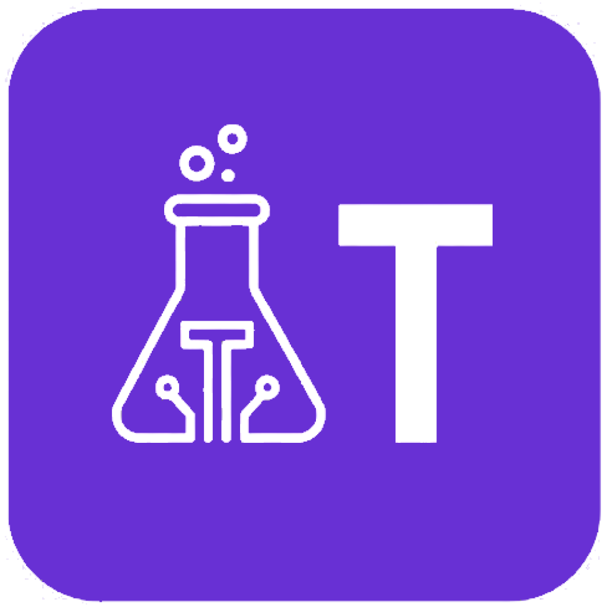

  

<h1 align="center">TokensLab</h1>

  <strong>The cost lab for your AI coding sessions.</strong> 
  Offline. Private. Free to download.

  
  
  

  
  
  
  

TokensLab is a desktop app that reads the session logs already on your machine — Claude Code, Cursor, Codex — and prices every turn against published rate cards. You see spend, burn rate, live vs idle sessions, and which files actually ran up the bill.

Nothing leaves your computer. There is no account, no telemetry, and no network call from the app.

  

## Why the number is the product

Claude Code records token counters, not dollars. Adding them up and multiplying by an input rate is wrong by about **5×** on real logs, because prompt-cache reads dominate and bill at **0.1×**.

| | Naive arithmetic | TokensLab (cache-aware) |
| --- | ---: | ---: |
| Same 66 MB of Claude Code logs | **$15,680.35** | **$3,123.97** |

Unpriced models are reported as a lower bound, never as free.

## Install

This repository is the public GitHub face of TokensLab: **installers and release notes**. The source tree stays private at launch.

| Platform | Download | Notes |
| --- | --- | --- |
| **Windows** 10 / 11 | [TokensLab-windows.exe](https://github.com/lucasbarroos/tokenslab-releases/releases/latest/download/TokensLab-windows.exe) | If SmartScreen appears: More info → Run anyway |
| **Linux** x64 | [TokensLab-linux.AppImage](https://github.com/lucasbarroos/tokenslab-releases/releases/latest/download/TokensLab-linux.AppImage) | `chmod +x TokensLab-linux.AppImage && ./TokensLab-linux.AppImage` |
| **macOS** Apple Silicon | — | This weekend, after Apple signing |

Or use the site: **[tokenslab.tech/download](https://tokenslab.tech/download)**

Then point the app at `~/.claude/projects` (Cursor and Codex folders are optional). That is the whole setup.

## What you get

- **Dashboard** — today, all-time, burn rate, cost by model and project
- **Sessions** — live vs idle (quiet sessions still cost money)
- **Graph Explorer** — files the model touched, sized by cache-aware cost
- **Skills Explorer** — prompts, tools and context packs that actually show up
- **Offline-first** — rate card ships in the installer

## Company

TokensLab is an independent product by [Lucas Barros](https://github.com/lucasbarroos). Site: [tokenslab.tech](https://tokenslab.tech) · mail: [hello@tokenslab.tech](mailto:hello@tokenslab.tech)

<table>
  <tr>
    <td align="center" width="160">
      <a href="https://github.com/lucasbarroos">
         
        <b>Lucas Barros</b>
      </a> 
      Founder
    </td>
  </tr>
</table>

Beta reports: open an [issue](https://github.com/lucasbarroos/tokenslab-releases/issues) or write to [hello@tokenslab.tech](mailto:hello@tokenslab.tech).

## License

Installers are provided as-is for the public beta. Source is not published at launch.
